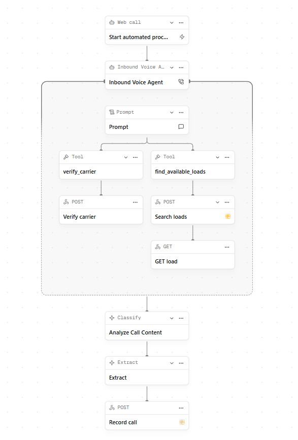

# Inbound Carrier Sales Automation

> An AI voice-agent proof of concept that answers inbound carrier calls, verifies authority, matches a load, negotiates the rate, and logs the outcome — with a live operations dashboard, all without depending on any platform's built-in analytics.

<p align="center">
  
  
  
  
  
</p>

---

## Table of Contents

- [Overview](#overview)
- [Call Workflow](#call-workflow)
- [Tech Stack](#tech-stack)
- [Repository Layout](#repository-layout)
- [Quick Start (Local)](#quick-start-local)
- [Run with Docker](#run-with-docker)
- [Configuration](#configuration)
- [How the Call Flow Works](#how-the-call-flow-works)
- [Demo Loads](#demo-loads)
- [API Reference](#api-reference)
- [Dashboard](#dashboard)
- [Utility Scripts](#utility-scripts)
- [HappyRobot Integration](#happyrobot-integration)
- [Documentation](#documentation)
- [Troubleshooting](#troubleshooting)
- [Current Limits](#current-limits)

---

## Overview

This project automates the full lifecycle of an **inbound carrier sales call**:

- **Carrier vetting** against the FMCSA register (live mode) or a deterministic mock (demo mode).
- **Load matching** by origin, destination, and equipment type from a demo load catalog.
- **Automated price negotiation** with a configurable ceiling and round limit.
- **Outcome capture** — every completed call is classified, sentiment-scored, and stored.
- **Custom reporting** — a Streamlit dashboard for bookings, failures, approval rate, and negotiation performance.

It ships in two runnable pieces:

| Service | What it is | Default URL |
| --- | --- | --- |
| **Backend API** | FastAPI app exposing the carrier-sales pipeline + a session-based bot | `http://localhost:8000` |
| **Dashboard** | Streamlit console: a "Bot Playground" to test calls and an "Ops Dashboard" for metrics | `http://localhost:8501` |

---

## Call Workflow

The same pipeline is exposed to the [HappyRobot](https://www.happyrobot.ai/) platform as a voice-agent workflow. Each node in the diagram maps directly to a backend endpoint.

<p align="center">
  
</p>

| Workflow node | Backend call | Purpose |
| --- | --- | --- |
| **Web call** → **Inbound Voice Agent** | `POST /agent/session` | Start the call and greet the carrier |
| **Prompt** | `POST /agent/respond` | Drive each conversational turn |
| **verify_carrier** → **Verify carrier** | `POST /carriers/verify` | Check MC authority |
| **find_available_loads** → **Search loads** | `POST /loads/search` | Match a load to the carrier's lane |
| **GET load** | `GET /loads/{load_id}` | Pull full load detail to pitch |
| **Analyze Call Content** (Classify) | `classify_sentiment` (analysis service) | Score carrier sentiment |
| **Extract** | `extract_relevant_call_data` | Pull structured data from the transcript |
| **Record call** | `POST /calls/record` | Persist the final outcome to SQLite |

> The diagram lives at `docs/images/happyrobot-workflow.png`. If it does not render, export the workflow screenshot from HappyRobot and save it to that path (see `docs/images/README.md`).

---

## Tech Stack

- **Backend:** FastAPI + Uvicorn, Pydantic models, requests (FMCSA), python-dotenv
- **Storage:** SQLite (`backend/data/calls.db`)
- **Dashboard:** Streamlit + Plotly + pandas
- **Packaging:** Docker + Docker Compose
- **Voice platform:** HappyRobot workflow package (`happyrobot/workflow_package/`)

---

## Repository Layout

```text
Chaitanya Nenavath/
├── backend/
│   ├── app/
│   │   ├── main.py              # FastAPI routes + auth
│   │   ├── config.py            # Env-driven settings
│   │   ├── database.py          # SQLite read/write
│   │   ├── models.py            # Pydantic models + outcome/sentiment enums
│   │   └── services/
│   │       ├── agent.py         # Session-based conversational bot
│   │       ├── call_flow.py     # End-to-end inbound call pipeline
│   │       ├── fmcsa.py         # Carrier verification (live + mock)
│   │       ├── loads.py         # Load catalog + search
│   │       ├── negotiation.py   # Rate negotiation logic
│   │       ├── analysis.py      # Sentiment + data extraction
│   │       ├── transcript.py    # Transcript enrichment on record
│   │       └── session_store.py # In-memory call sessions
│   ├── data/
│   │   ├── loads.json           # 8 demo loads (LD001–LD008)
│   │   └── calls.db             # SQLite call store
│   ├── scripts/                 # Seed data, smoke test, call simulation, MCP token
│   ├── .env.example
│   ├── Dockerfile
│   └── requirements.txt
├── dashboard/
│   ├── app.py                   # Streamlit console (Playground + Ops Dashboard)
│   └── Dockerfile
├── happyrobot/workflow_package/ # Agent prompt, tool contracts, workflow nodes
├── docs/                        # Solution brief, deployment, HappyRobot setup, etc.
├── docker-compose.yml
├── start_local.ps1              # Launch API + dashboard (Windows)
├── stop_local.ps1
└── README.md
```

---

## Quick Start (Local)

### Prerequisites

- Python **3.11+**
- (Optional) An FMCSA Web API key for live carrier verification

### 1. Install dependencies

```bash
python -m venv .venv
# Windows:  .venv\Scripts\activate
# macOS/Linux:  source .venv/bin/activate
pip install -r backend/requirements.txt
```

### 2. Configure environment

```bash
cp backend/.env.example backend/.env
```

The defaults run a fully working demo (mock carrier verification, `API_KEY=local-demo-api-key`). See [Configuration](#configuration) to go live.

### 3. Start the API (from `backend/`)

```bash
cd backend
uvicorn app.main:app --reload --port 8000
```

### 4. Start the dashboard (from the repo root)

```bash
streamlit run dashboard/app.py
```

Open **http://localhost:8501**, enter the API base URL and key in the sidebar (defaults are pre-filled), and use the **Bot Playground** tab to test a call.

### One-command launch (Windows PowerShell)

```powershell
./start_local.ps1   # opens API (127.0.0.1:8000) and dashboard (127.0.0.1:8501)
./stop_local.ps1    # stops both
```

---

## Run with Docker

```bash
docker compose up --build
```

| Service | URL |
| --- | --- |
| API | http://localhost:8000 |
| Dashboard | http://localhost:8501 |

Both containers share the `backend/data` volume, so call records written by the API appear in the dashboard immediately.

---

## Configuration

All settings are read from `backend/.env` (see `backend/.env.example`).

| Variable | Default | Description |
| --- | --- | --- |
| `API_KEY` | `local-demo-api-key` | Shared secret required in the `x-api-key` header on every request |
| `FMCSA_API_KEY` | _(empty)_ | FMCSA Web API key for live carrier lookups |
| `FMCSA_MOCK_MODE` | `true` | When `true` (or no API key), uses deterministic mock verification |
| `NEGOTIATION_MARGIN` | `0.10` | Maximum premium accepted above the posted rate (10%) |
| `NEGOTIATION_MAX_ROUNDS` | `3` | Maximum carrier counter-offers per call |
| `REQUEST_TIMEOUT_SECONDS` | `10` | HTTP timeout for FMCSA calls |
| `HAPPYROBOT_ORG_API_KEY` | _(empty)_ | Org key used by the MCP token helper script |
| `HAPPYROBOT_CLUSTER` | `us` | HappyRobot cluster region |

> To go live: set a real `FMCSA_API_KEY` and `FMCSA_MOCK_MODE=false`.

---

## How the Call Flow Works

1. **Verify the carrier.** The MC number is checked against FMCSA. In **mock mode**, any 6-digit number works and the result is deterministic: **MC numbers ending in `0` or `5` are treated as blocked**, everything else is approved (e.g. `123456` → approved, `123450` → blocked).
2. **Match a load.** The carrier's origin, destination, and equipment type are matched against the demo catalog. A load ID like `LD001` can also be given directly.
3. **Pitch the load** at the posted `loadboard_rate`.
4. **Negotiate.** A carrier offer is accepted when it is **at or below** the ceiling:

   ```
   ceiling = posted_rate × (1 + NEGOTIATION_MARGIN)      # default 10%
   accepted = carrier_offer ≤ ceiling
   ```

   Up to `NEGOTIATION_MAX_ROUNDS` (default 3) offers are evaluated. If the carrier simply accepts, the load books at the posted rate.
5. **Record the outcome.** The transcript is classified for **sentiment** and structured fields are **extracted**, then the call is saved to SQLite.

**Possible outcomes:** `BOOKED`, `NEGOTIATION_FAILED`, `NOT_INTERESTED`, `CARRIER_NOT_ELIGIBLE`, `NO_LOAD_FOUND`
**Sentiment labels:** `POSITIVE`, `NEUTRAL`, `NEGATIVE`

---

## Demo Loads

Eight demo loads ship in `backend/data/loads.json`:

| Load | Lane | Equipment | Posted Rate |
| --- | --- | --- | --- |
| LD001 | Dallas, TX → Atlanta, GA | Dry Van | $1,800 |
| LD002 | Atlanta, GA → Miami, FL | Reefer | $1,650 |
| LD003 | Savannah, GA → Charlotte, NC | Flatbed | $1,200 |
| LD004 | Marietta, GA → Nashville, TN | Dry Van | $950 |
| LD005 | Columbus, OH → Cartersville, GA | Reefer | $1,830 |
| LD006 | Macon, GA → Jacksonville, FL | Dry Van | $700 |
| LD007 | Gainesville, GA → Memphis, TN | Flatbed | $1,450 |
| LD008 | Augusta, GA → Birmingham, AL | Power Only | $1,100 |

---

## API Reference

Interactive docs (`/docs`, `/redoc`) are intentionally disabled. Every endpoint requires the `x-api-key` header.

| Method | Path | Description |
| --- | --- | --- |
| `GET` | `/health` | Liveness check |
| `GET` | `/loads` | List all demo loads |
| `GET` | `/loads/{load_id}` | Single load detail |
| `POST` | `/loads/search` | Search loads by origin / destination / equipment |
| `POST` | `/carriers/verify` | Verify an MC number (FMCSA live or mock) |
| `POST` | `/negotiations/evaluate` | Evaluate carrier offers against the ceiling |
| `POST` | `/calls/process` | Run the full inbound-call pipeline in one shot |
| `POST` | `/calls/record` | Persist a completed call (classify + extract) |
| `GET` | `/calls?limit=N` | Fetch recent call records (`1`–`500`, default `100`) |
| `POST` | `/agent/session` | Start a conversational bot session |
| `POST` | `/agent/respond` | Send a carrier utterance and get the next turn |

**Health check example:**

```bash
curl -H "x-api-key: local-demo-api-key" http://localhost:8000/health
# {"status":"running","service":"carrier-sales-api"}
```

> On Windows PowerShell, use `curl.exe` (not the `curl` alias) or `Invoke-RestMethod -Headers @{ "x-api-key" = "local-demo-api-key" }`.

---

## Dashboard

The Streamlit console (`dashboard/app.py`) has two tabs and a Dark/Light theme toggle:

- **Bot Playground** — start a call, run a scripted booked demo, and chat as a carrier; a live panel shows the current stage, matched load, and negotiation snapshot.
- **Ops Dashboard** — headline KPIs (Total Calls, Booked Loads, Failed Negotiations, Booking Success Rate, Average Final Rate) plus plain-language charts for call outcomes, carrier sentiment, calls per load, and approvals, with sidebar filters by outcome / sentiment / load.

---

## Utility Scripts

Run from the `backend/` directory:

| Script | Purpose |
| --- | --- |
| `scripts/seed_data.py` | Seed the SQLite store with sample call records |
| `scripts/smoke_test.py` | Quick end-to-end check of the API |
| `scripts/simulate_agent_call.py` | Drive a full bot conversation programmatically |
| `scripts/happyrobot_mcp_token.py` | Mint a HappyRobot MCP auth token |

---

## HappyRobot Integration

The `happyrobot/workflow_package/` folder holds everything needed to recreate the voice agent on the platform:

- `agent_prompt.md` — the system prompt for the inbound voice agent
- `tool_contracts.json` — request/response contracts for each tool node
- `workflow_nodes.md` — node-by-node build guide (mirrors the diagram above)
- `sample_conversations.md` — example carrier dialogues

Point the HappyRobot tools at the same API base URL and `x-api-key` you use locally or in your deployment.

---

## Documentation

| Doc | Contents |
| --- | --- |
| `docs/broker_solution_brief.md` | Broker-facing description of the build |
| `docs/client_update_email.md` | Client update email |
| `docs/deployment.md` | Deployment and reproducibility guide |
| `docs/happyrobot_workflow.md` | HappyRobot workflow design |
| `docs/happyrobot_platform_setup.md` | Platform setup steps |
| `docs/happyrobot_mcp_auth.md` | MCP auth notes |
| `docs/final_submission_checklist.md` | Submission checklist |
| `docs/submission_links_template.md` | Links template |
| `docs/video_walkthrough_outline.md` | Demo video outline |

---

## Troubleshooting

- **"API not reachable" in the dashboard** — make sure the backend is running on the URL shown in the sidebar and that the `API_KEY` matches `backend/.env`.
- **`401 Invalid API key`** — the `x-api-key` header does not match `API_KEY`.
- **Carrier always blocked in a demo** — mock mode blocks MC numbers ending in `0` or `5`; try one like `123456`.
- **FMCSA lookups failing** — confirm `FMCSA_API_KEY` is set, `FMCSA_MOCK_MODE=false`, and the host has network access.

---

## Current Limits

- The repo includes the HappyRobot workflow design and prompts, but not a live platform link.
- Docker and deployment instructions are included, but not a live cloud URL.
- FMCSA live verification requires a valid API key and network access; **mock mode is on by default** for demos.
